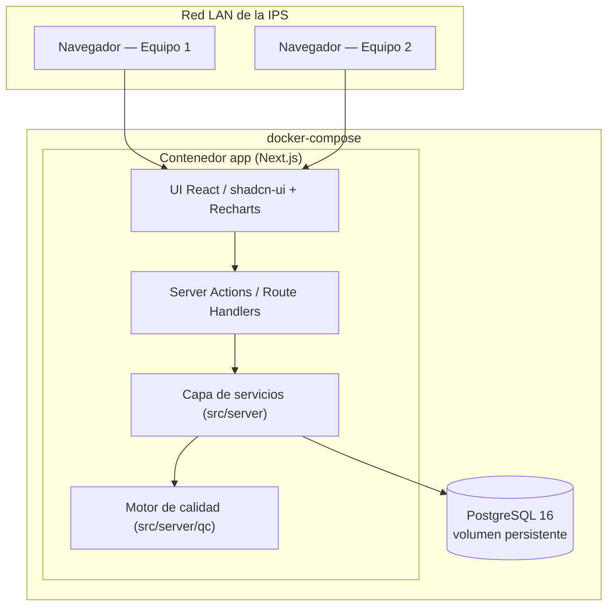
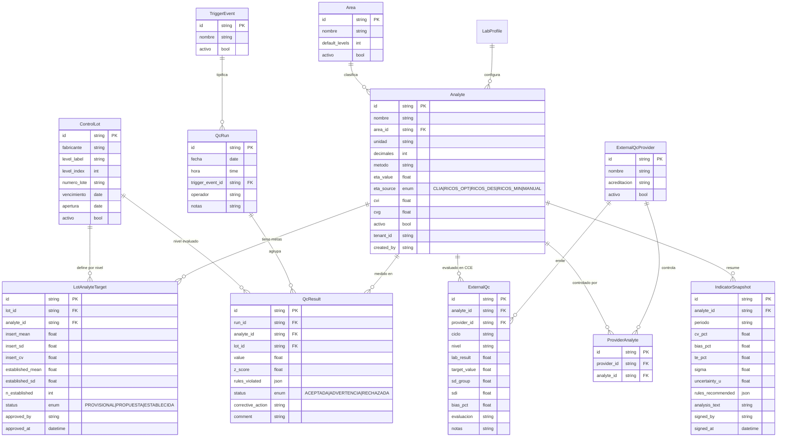
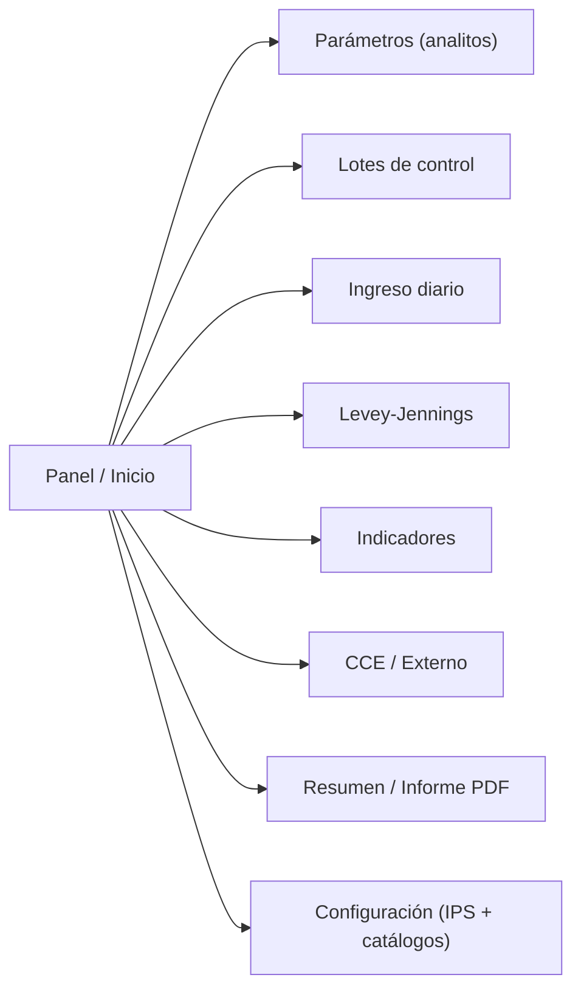

# SDD — Software Design Document
## Aplicación de Gestión de Calidad Analítica (JPQC)

| Campo | Valor |
|-------|-------|
| Proyecto | JPQC — Sistema de Control de Calidad Analítico para IPS de laboratorio clínico |
| Versión del documento | 1.0 |
| Fecha | 2026-07-18 |
| Product Owner | Bacterióloga / especialista en control de calidad analítica |
| Estado | Aprobado para inicio de construcción |

---

## 1. Introducción

### 1.1 Propósito
Definir el diseño de software de una aplicación web para documentar y gestionar el control de
calidad analítica del laboratorio clínico, integrando control interno (CCI) y externo (CCE),
gráficas de Levey-Jennings, reglas de Westgard, indicadores de competencia analítica e
incertidumbre de medición.

### 1.2 Alcance
La v1 cubre las áreas de **Química** (2 niveles de control), **Coagulación** (2 niveles) y
**Hematología** (3 niveles), mediante un motor genérico de *N* niveles. Incluye parametrización
de analitos y lotes, ingreso diario de resultados, evaluación automática de reglas, gráficas,
cálculo de indicadores e incertidumbre, módulo de CCE genérico e informes PDF firmables.

No incluye en v1: autenticación de usuarios (se deja arquitectura preparada), interfaces con
analizadores (LIS/middleware), ni facturación.

### 1.3 Definiciones y acrónimos

| Sigla | Significado |
|-------|-------------|
| CCI | Control de Calidad Interno |
| CCE | Control de Calidad Externo (evaluación externa del desempeño) |
| LJ | Gráfica de Levey-Jennings |
| DS | Desviación estándar |
| CV | Coeficiente de variación (%) |
| ETa | Error Total permitido (allowable) |
| ET | Error Total observado |
| Sigma (σ) | Métrica Sigma de desempeño del método |
| SDI | Índice de Desviación Estándar (CCE) |
| Diana | Valor asignado / objetivo del control |
| CVi / CVg | Variabilidad biológica intra / interindividual (Ricós) |
| IPS | Institución Prestadora de Servicios de salud |
| PO | Product Owner |
| Tercera opinión | Control independiente del fabricante del reactivo/equipo |

---

## 2. Marco normativo y de referencia

- **Resolución 3100 de 2019** (habilitación de servicios de salud, Colombia).
- **Decreto 1011 de 2006** (SOGCS).
- **Resolución 0256 de 2016** (indicadores de calidad).
- **NTC-ISO 15189:2022**, numeral 7.3 (proceso analítico) y 7.3.3 (incertidumbre).
- **CLSI C24** (control estadístico de calidad para métodos cuantitativos) — establecimiento de
  media/DS con ≥20 corridas.
- **CLIA 88** — Error Total permitido (ETa) por analito.
- **Base de variabilidad biológica de Ricós** — criterios óptimo/deseable/mínimo (CVi, CVg).
- **Westgard Sigma Rules** — selección de reglas según la métrica Sigma.

Estas referencias sustentan los algoritmos y los criterios de aceptación del sistema.

---

## 3. Requisitos

### 3.1 Requisitos funcionales

| ID | Módulo | Requisito |
|----|--------|-----------|
| RF-01 | Parámetros | Crear/editar/inactivar analitos con área, unidad, decimales, método/equipo. |
| RF-02 | Parámetros | Definir ETa por fuente (CLIA, Ricós óptimo/deseable/mínimo, manual) y guardar el valor efectivo; registrar CVi/CVg. |
| RF-03 | Lotes | Registrar lotes de control de tercera opinión con nivel, número de lote, vencimiento, apertura. |
| RF-04 | Lotes | Capturar valores del inserto (diana + DS) por nivel y analito; calcular `insert_cv`. |
| RF-05 | Ingreso | Registrar corridas (1 o varias/día) con fecha, hora, evento disparador (catálogo editable) y operador. |
| RF-06 | Ingreso | Ingresar el resultado por nivel y evaluar reglas Westgard-Sigma **en vivo** antes de guardar. |
| RF-07 | Ingreso | Capturar observación y acción correctiva por corrida/resultado. |
| RF-08 | Motor | Calcular media/DS/CV acumulados; a ≥20 corridas válidas, **proponer** media/DS del laboratorio. |
| RF-08b | Motor | La media/DS propuesta requiere **aprobación de la supervisora** (registra autor y fecha) antes de reemplazar al inserto. |
| RF-09 | Motor | Seleccionar automáticamente el set de reglas según Sigma y aplicarlo. |
| RF-10 | LJ | Graficar Levey-Jennings por analito/nivel con líneas ±1/2/3 DS y color por estado. |
| RF-11 | Indicadores | Calcular CV%, sesgo%, ET%, Sigma e incertidumbre expandida; comparar ET contra ETa. |
| RF-12 | CCE | Registrar resultados del programa externo y calcular sesgo/SDI; alimentar indicadores. |
| RF-12b | CCE | Administrar **proveedores de CCE** (crear/editar) y vincular a cada uno los analitos que controla. |
| RF-13 | Informe | Generar informe mensual consolidado con análisis cualitativo y firma, exportable a PDF. |
| RF-14 | Configuración | Editar el perfil de la IPS para el encabezado de informes. |
| RF-15 | Catálogos | Administrar catálogos editables: Áreas, Eventos disparadores, Proveedores de CCE y Analitos (crear/editar/inactivar), con datos precargados (seed). |

### 3.2 Requisitos no funcionales

- **Usabilidad**: interfaz en español, profesional (no juvenil), curva de aprendizaje baja para
  personal de laboratorio; validación inmediata en formularios.
- **Rendimiento**: respuesta < 1 s en operaciones típicas con miles de corridas por lote.
- **Trazabilidad / auditoría**: cada registro guarda fecha/hora y (a futuro) autor; los informes
  se firman con nombre + fecha.
- **Disponibilidad LAN**: accesible desde varios equipos de la red interna vía navegador.
- **Escalabilidad cloud-ready**: esquema con `tenant_id`/`created_by` para migrar a multiusuario.
- **Accesibilidad**: componentes Radix, contraste adecuado, navegación por teclado, modo claro/oscuro.
- **Mantenibilidad**: motor de cálculo aislado y cubierto por pruebas unitarias.
- **Integridad de datos**: PostgreSQL con restricciones referenciales y migraciones versionadas.

---

## 4. Arquitectura

### 4.1 Vista general
Aplicación web monolítica full-stack en **Next.js (App Router)**, desplegada con **Docker Compose**
junto a **PostgreSQL**. La UI (React Server/Client Components) consume la lógica de negocio a través
de **Server Actions / Route Handlers**, que a su vez usan una **capa de servicios** (`src/server/`)
sobre **Prisma**.

### 4.2 Capas
- **Presentación** (`src/app/**`): páginas y componentes por módulo; estado de UI y formularios (Zod).
- **API** (`src/app/api/**`, Server Actions): validación de entrada, orquestación.
- **Servicios** (`src/server/**`): reglas de negocio y acceso a datos (Prisma) — único punto de
  contacto con la base; aquí se inyectará auth/tenancy a futuro.
- **Motor de calidad** (`src/server/qc/**`): funciones puras de estadística, Westgard, Sigma,
  indicadores e incertidumbre (sin dependencias de BD → testeable).
- **Persistencia**: PostgreSQL vía Prisma.

### 4.3 Preparación multiusuario / cloud
Columnas `tenant_id` (default `'default'`) y `created_by` en las tablas de datos; capa de servicios
como frontera para insertar un middleware de autenticación/tenancy sin refactor del esquema.

---

## 5. Modelo de datos

### 5.1 Diagrama entidad-relación

> **Catálogos administrables por la PO** (crear/editar/inactivar desde la app): `Area`,
> `TriggerEvent`, `ExternalQcProvider` y `Analyte`. Cada proveedor de CCE se vincula, vía
> `ProviderAnalyte`, con los analitos que controla. Se reemplazan los antiguos `enum` fijos de
> área y evento por estos catálogos, sin perder la capacidad de traer valores por defecto (seed).

### 5.2 Notas de diseño
- **Media/DS efectivas**: si `LotAnalyteTarget.status = ESTABLECIDA` (aprobada por la supervisora)
  se usan `established_*`; en `PROVISIONAL` o `PROPUESTA` se usan `insert_*`. La gráfica y las reglas
  usan siempre el valor efectivo. El estado `PROPUESTA` (n≥20, pendiente de aprobación) muestra la
  media/DS calculada como sugerencia sin aplicarla aún.
- Una **corrida** (`QcRun`) agrupa varios `QcResult` (por analito y nivel), lo que permite evaluar
  reglas entre niveles (R_4s, 2de3_2s) dentro del mismo evento.
- `rules_violated` y `rules_recommended` se guardan como JSON para flexibilidad.
- Los **niveles** con que se controla cada analito no son fijos: resultan de los lotes de control
  (`ControlLot`) que la PO registre. `Area.default_levels` es solo una guía para el montaje.

### 5.3 Seed inicial (datos precargados, editables)

**Áreas** (catálogo editable, con niveles esperados como guía):

| Área | Niveles (guía) |
|------|:--------------:|
| Química clínica | 2 |
| Química especial | 3 |
| Hematología | 3 |
| Coagulación | 2 |
| Inmunoensayo | 3 |

**Analitos** (28 precargados; la PO puede crear más):

| Área | Analitos |
|------|----------|
| Química clínica | GLUCOSA, COLESTEROL TOTAL, TRIGLICÉRIDOS, CREATININA, ÁCIDO ÚRICO, NITRÓGENO UREICO (BUN), TGO, TGP, BILIRRUBINA TOTAL, BILIRRUBINA DIRECTA, FOSFATASA ALCALINA, AMILASA |
| Química especial | HB GLICADA, MICROALBUMINURIA |
| Hematología | WBC, RBC, HEMATOCRITO, HEMOGLOBINA, %IDE (RDW), VCM, CMH (HCM), CMHC (CHCM), PLAQUETAS |
| Coagulación | PT, PTT |
| Inmunoensayo | TSH, PSA, T4 LIBRE |

> Para cada analito, el ETa y los CVi/CVg se cargan desde la referencia interna **CLIA 88 / Ricós**
> cuando exista valor para ese analito; en los que no (varios inmunoensayos), quedan en modo
> **MANUAL** para que la PO ingrese el criterio. Los valores precargados se validan con la PO antes
> de darlos por definitivos. Los **eventos disparadores** se siembran con RUTINA, CALIBRACIÓN,
> CAMBIO_REACTIVO, CAMBIO_LOTE_CONTROL, VERIFICACIÓN_POST_AVERÍA y MANTENIMIENTO, y son editables.

---

## 6. Diseño del motor de calidad (`src/server/qc/`)

### 6.1 Estadística acumulada y transición provisional → establecida
Para cada (lote-nivel × analito) se calculan media, DS y CV sobre los `QcResult` válidos del lote
vigente. Al alcanzar **n ≥ 20** corridas válidas el sistema **propone** la media/DS del laboratorio
y `status` pasa a `PROPUESTA`. La supervisora la **revisa y aprueba**; solo entonces `status` pasa
a `ESTABLECIDA`, se registra `approved_by` / `approved_at`, y la gráfica/reglas usan la media/DS
establecidas. Hasta la aprobación se sigue usando el inserto (PROVISIONAL). El inserto se conserva
siempre como referencia.

- `media = Σx / n`
- `DS = √( Σ(x − media)² / (n − 1) )`
- `CV% = DS / media × 100`

### 6.2 Reglas de Westgard
Se implementan como funciones puras que reciben la serie histórica y la corrida actual:

| Regla | Detecta | Acción |
|-------|---------|--------|
| 1_2s | Advertencia | Revisar con las demás |
| 1_3s | Error aleatorio | Rechazar |
| 2_2s | Error sistemático | Rechazar |
| R_4s | Error aleatorio (entre niveles, misma corrida) | Rechazar |
| 4_1s | Error sistemático | Rechazar |
| 10x | Error sistemático | Rechazar |
| 2de3_2s | Sistemático (3 niveles) | Rechazar |
| 3_1s | Sistemático (3 niveles) | Rechazar |

Resultado: estado `ACEPTADA | ADVERTENCIA | RECHAZADA` + lista de reglas violadas.

### 6.3 Selección automática por Sigma (Westgard Sigma Rules)
Se calcula Sigma por analito y se selecciona el set de reglas y el **N recomendado** (número de
controles). La regla de racha larga usada es **10x**.

| Sigma | Set de reglas | N recomendado | Interpretación |
|-------|---------------|:-------------:|----------------|
| ≥ 6 | `1_3s` | 2 | Excelente; reglas simples |
| 5 | `1_3s / 2_2s / R_4s` | 2 | Bueno |
| 4 | `1_3s / 2_2s / R_4s / 4_1s / 10x` | 4 | Aceptable |
| < 4 | `1_3s / 2_2s / R_4s / 4_1s / 10x` | 4 (o más) | "Proceso a mejorar" |
| < 3 | Multirregla completa + alerta | ≥ 4 | Proceso inaceptable |

El set activo y su N se muestran explícitamente en el módulo Indicadores y el set se aplica en la
evaluación de las corridas del analito.

### 6.4 Indicadores de competencia analítica

- **Imprecisión**: `CV% = DS / media × 100` (datos acumulados del laboratorio).
- **Sesgo (inexactitud)**: `bias% = (media_lab − diana) / diana × 100`.
  - `diana` = valor del CCE si existe; si no, valor asignado del inserto, rotulado
    **"provisional – sin CCE"** (estimación, no sesgo metrológico verdadero).
- **Error total**: `ET% = |bias%| + 2·CV%` (95%). Competente si `ET% < ETa`.
- **Sigma**: `σ = (ETa − |bias%|) / CV%`.
- **Incertidumbre expandida**: `U = 2 · √(u_prec² + u_bias²)`
  - `u_prec` derivada del CV; `u_bias` del componente de sesgo del CCE.
  - Sin CCE: `U ≈ 2 · u_prec`, con nota de que falta el componente de sesgo.

### 6.5 Pruebas
Cada función del motor se cubre con **Vitest** usando datasets de referencia con resultados
conocidos, incluyendo el caso de transición a los 20 datos y disparos de cada regla.

---

## 7. Diseño de UI/UX

### 7.1 Principios
Entorno **clínico, sobrio y profesional** (no juvenil): paleta de azules/teal/slate, alta
legibilidad, densidad de datos controlada, estados por color consistentes
(**verde** = aceptada, **ámbar** = advertencia, **rojo** = rechazada). Modo claro/oscuro y
accesibilidad (Radix). Se aplican las skills de diseño de frontend y dataviz.

### 7.2 Mapa de navegación

Navegación lateral fija por módulo; el flujo lógico de trabajo es
Parámetros → Lotes → Ingreso diario → Levey-Jennings → Indicadores → CCE → Resumen.

---

## 8. Despliegue

- **docker-compose** con dos servicios:
  - `db`: `postgres:16`, volumen persistente, healthcheck.
  - `app`: build de Next.js; espera a `db`; ejecuta `prisma migrate deploy` y `next start`.
- `.env` con `DATABASE_URL` y credenciales; puerto expuesto en la LAN.
- `README.md` con instrucciones (`docker compose up`) y guía de primeros pasos.

---

## 9. Estrategia de pruebas y verificación

- **Unitarias (Vitest)**: motor de estadística, Westgard, Sigma, indicadores e incertidumbre.
- **End-to-end manual**: levantar con `docker compose up`, crear analito y lote, ingresar ~25
  corridas y verificar gráfica LJ, disparo de reglas, transición a media/DS establecida,
  indicadores/Sigma y generación de PDF.
- **Verificación en navegador (MCP)** del flujo de los 8 módulos.

---

## 10. Roadmap por fases y decisiones pendientes

### Fases
0. Andamiaje (Next.js, Prisma, docker-compose, esquema inicial).
1. Parametrización (Analitos, Lotes).
2. Motor + Ingreso diario.
3. Levey-Jennings + Indicadores.
4. CCE + Informes PDF + Configuración.
5. Cierre (datos demo, pulido, documentación de uso).

### Decisiones pendientes (no bloquean el inicio)
- **Lista concreta de analitos** con sus ETa/CVi/CVg (la PO los carga o los envía como seed).
- **Proveedor final de CCE** (módulo genérico hasta definirlo).

---

*Documento base para la construcción. Cambios de alcance se reflejan actualizando este SDD y el
`PLAN.md`.*
